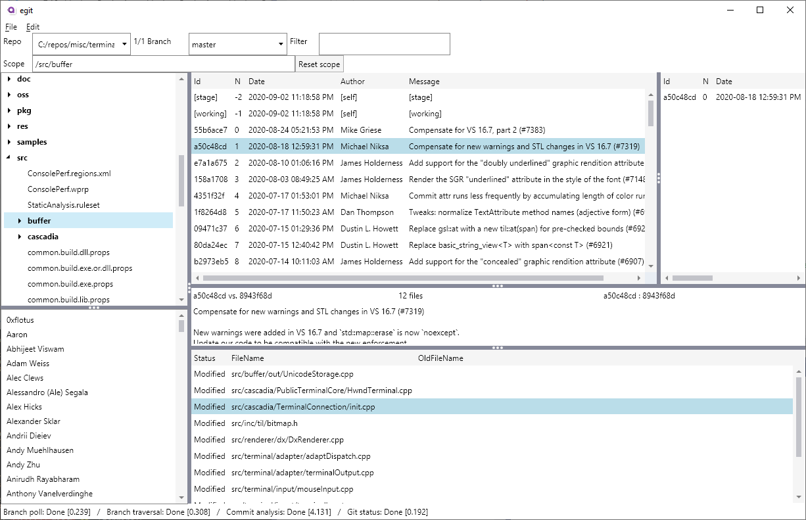

# egit

A cross-platform UI git client.

# The case for another git client

When I started using git, there were aspects of Perforce/P4V that I really missed. I tried searching for an existing UI-based git client that would hit all these features:

## Criteria

1. There needs to be a **commit list view** where each line is a *separate* chunk of work, usually corresponding to a new PR by a person independent of the previous line. If that person has chosen to submit their PR as a "rebase and fast-forward" merge instead of a squash merge, it might be OK to show all the commits because that's what they intended. Basically I'm looking for the equivalent of the `--first-parent` parameter in `git log`.

2. There needs to be a way to view pending changes, whether they're unstaged or staged. It's natural to think of these pending changes as a "fake" commit that would actually be in the same list as all the other commits, preceding them (in reverse chronological order).

3. When you select a commit (from the commit list view), a list of changed files (between that commit and the commit immediately below it in the list) needs to appear.

4. There's a way to quickly browse the diffs of each of those changed files. You can navigate changes with the keyboard only.

5. You should be able to select two arbitrary commits to get the list of changed files between them.

6. You can save a commit as a patch ("shelf" in P4V/egit lingo).

7. When ready to submit files, you can select a subset of them to: submit just those files, or maybe create a patch for later.

8. The app should respond immediately when there are underlying file system changes.

9. Like in P4V, there should be a **file system tree view**. When you browse the file system, the commit list view should be _scoped_ to just those commits that possibly affect the selected file or folder.  Also, you should be able to hit a shortcut key to open the selected file or folder in Windows Explorer/Finder.

10. There should be a **user list view**.  When you select a user, the commit list should be scoped to just those commits that were authored by that user.

11. If a PR was submitted with a bunch of individual commits, but they weren't squashed, it should be possible to view the individual commits of that PR (but not in the main commit list view by default!)

12. (Anti-feature: You may notice that there is no mention of git graph capability in this list. If you think about the main branch, it's clearly built up from a set of serial commits by different people at different times. I don't care what the rebase/merge strategy was for individual PRs. There's no reason I should see both "Merged PR: did XXX" and "did XXX" right before it with a little loop and a hop. This kind of convoluted, twisty turny graph has never been helpful to me.)

I tried to find an existing git client that checked all the boxes. See some [reviews](docs/Reviews-of-other-git-clients.md). It seemed like every existing git client had _something_ missing, so egit tries to implement the features above.

# Dependencies

It is written in C# using dotnet core. 

It uses [Avalonia](https://avaloniaui.net/) for the UI framework so it can be cross-platform (Windows and Mac).

It uses [libgit2](https://github.com/libgit2/libgit2sharp) for git functionality.

# Progress

During the week of 2020-08-31, I ported an earlier version of egit that was based on WinForms to this new version based on Avalonia. It is not quite feature-complete yet. For instance, it's not possible to select a repo in the app itself. (As a workaround, edit the user settings file beforehand....)